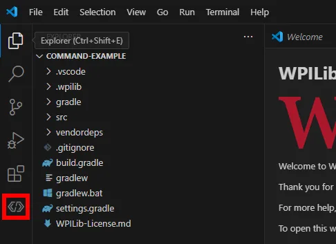

# Managing Vendor Libraries in VS Code

Vendor libraries (vendordeps) allow your robot project to use hardware-specific code such as CTRE, REV, or NavX.

---

## 📦 Installing a Vendor Library

### 1. Open the WPILib Extension
- In **VS Code**, click the **WPILib icon** in the Activity Bar (left sidebar).  
- This opens the **WPILib Command Palette**.



---

### 2. Open Vendor Library Manager
- From the command list, select:  
  **Manage Vendor Libraries → Install new libraries (offline/online)**  

*(screenshot: “Manage Vendor Libraries” menu with options)*

---

### 3. Choose Online or Offline Install
- **Online Install**:  
  - Paste the vendor’s JSON URL (provided on vendor website).  
  - Example: CTRE Phoenix JSON URL.  
  - VS Code downloads the latest version from the internet.  

*(screenshot: text input for JSON URL)*

- **Offline Install**:  
  - Use a JSON file or installer downloaded from vendor.  
  - Recommended when possible because offline installers may include extra tools/utilities.  

*(screenshot: file picker for offline vendordep JSON)*

---

### 4. Verify Installation
- The library JSON file appears in your project’s `/vendordeps/` folder.  
- Example: `vendordeps/Phoenix.json`  

*(screenshot: vendordeps folder in project with JSON files)*

---

## 🔄 Updating Vendor Libraries

### 1. Open Vendor Library Manager
- Go to: **Manage Vendor Libraries → Check for updates (online)**  

*(screenshot: update dialog with “To Latest” button)*

### 2. Update to Latest
- Click **To Latest** to update the selected library.  
- Or click **Update All** to update every vendordep in the project.  

### 3. Downgrade (Optional)
- You can also pick an earlier version from the list if needed for compatibility.

---

## ❌ Removing a Vendor Library

- Go to: **Manage Vendor Libraries → Manage current libraries**  
- Select the library you want to remove.  
- The JSON file will be deleted from `/vendordeps/`.

*(screenshot: removal confirmation dialog)*

---

## ⚙️ Command Line Option

You can also add a vendordep directly from the command line:

```bash
./gradlew vendordep --url=vendor_json_url
```

This places the JSON into your project automatically.

---

## 📂 Under the Hood

- JSON files live inside your project: `myrobot/vendordeps/`  
- Cached libraries are stored in WPILib’s Maven folder:  
  - Windows: `C:\Users\Public\wpilib\<year>\maven`  
  - macOS/Linux: `~/wpilib/<year>/maven`  

*(screenshot: file paths shown in VS Code)*

---

## 🧰 Examples of Vendor Libraries

- **CTRE Phoenix** – Talon SRX, Talon FX, Victor SPX, CANifier, Pigeon IMU  
- **REV Robotics** – SPARK MAX, NEO motors, REV sensors  
- **Kauai Labs NavX** – gyro/IMU boards  
- **Playing With Fusion** – sensors and controllers  
- **Studica** – FRC servo controllers and devices  
- **PhotonVision / AprilTag** – vision processing  
- **PathPlannerLib** – motion profiling and trajectory generation  
