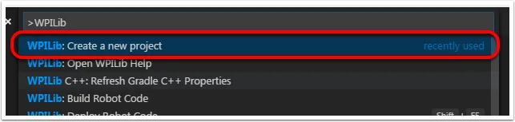
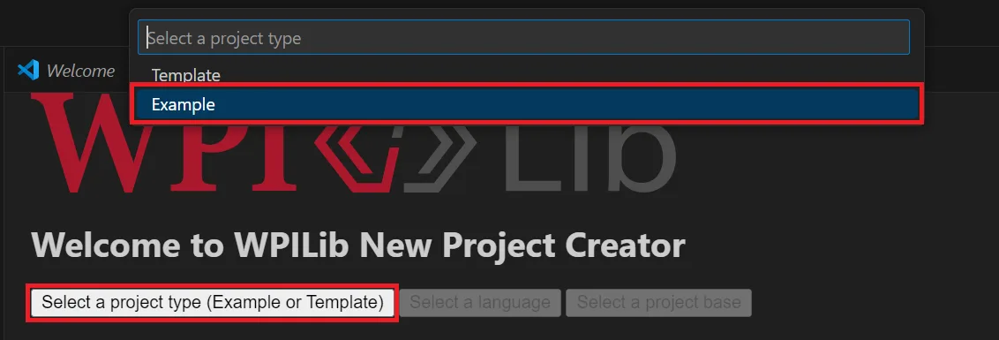
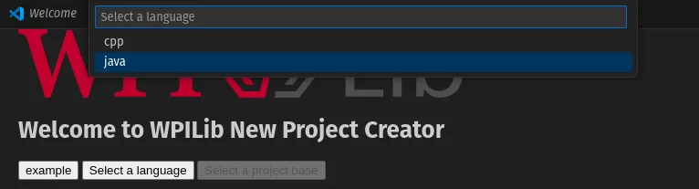
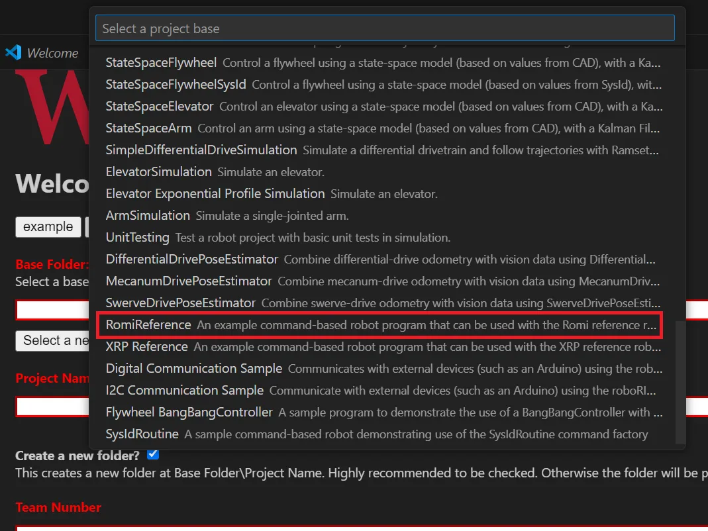
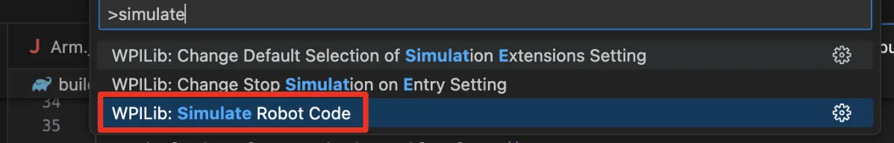

# Programming the Romi

Writing a program for the Romi is very similar to writing a program for a regular FRC robot. In fact, all the same tools (Visual Studio Code, Driver Station, SmartDashboard, etc) can be used with the Romi.

## Creating a Romi Program

Creating a new program for a Romi is like creating a normal FRC program, similar to the *Zero To Robot* programming steps.

WPILib comes with two templates for Romi projects, including one based on **TimedRobot**, and a **Command-Based** project template. Additionally, an example project is provided which showcases some of the built‑in functionality of the Romi. This article will walk through creating a project from this example.

> **Note**  
> In order to program the Romi using C++, a compatible C++ desktop compiler must be installed. See *Robot Simulation — Additional C++ Dependency*.

### Creating a New WPILib Romi Project

Bring up the Visual Studio Code command palette with `Ctrl+Shift+P`, and type “New project” into the prompt. Select the “Create a new project” command:




1. This brings up the “New Project Creator Window”. Click on “Select a project type (Example or Template)”, and pick **Example** from the prompt that appears.  
   
2. Select the programming language you want to use.  
   
3. Next, a list of examples will appear. Scroll through the list to find the **RomiReference** example.  
   
4. Fill out the rest of the fields in the “New Project Creator” and click “Generate Project” to create the new robot project.

### Running a Romi Program

Once the robot project is generated, it is essentially ready to run. The project has a pre-built `Drivetrain` class and associated default command that lets you drive the Romi around using a joystick.

One important difference between a Romi project and a regular FRC robot project is **code deployment**:  
- The Romi project runs on your development computer and leverages the WPILib simulation framework to communicate with the Romi robot (rather than deploying code directly to the robot).  
- To run a Romi program:
  1. Ensure your Romi is powered on.  
  2. Connect to the `bobcats-<number>` WiFi network broadcast by the Romi.  
     - If you changed the Romi network settings (for example, to connect it to your own WiFi network), you may need to update the IP address used in your program.  
     - Open the `build.gradle` file and update the `wpi.sim.envVar` line to the appropriate IP address, e.g.:
       ```gradle
       wpi.sim.envVar("HALSIMWS_HOST", "10.0.0.2")
       wpi.sim.addWebsocketsServer().defaultEnabled = true
       wpi.sim.addWebsocketsClient().defaultEnabled = true
       ```
  3. Start the simulation via WPILib:  
     - Open the WPILib Command Palette (`Ctrl+Shift+P`) and select **Simulate Robot Code**, or press `F5`.  
     
  4. If successful, you should see in the console output:  
     ```
     HALSimWS: WebSocket Connected
     ```

Your Romi code is now running!
